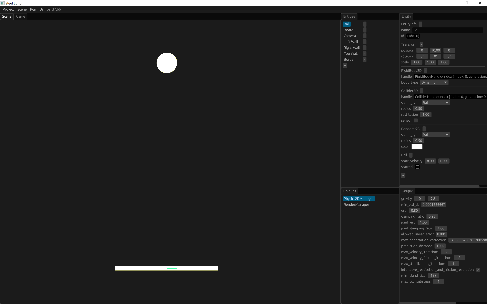

# The Steel Game Engine

Steel is an open source cross-platform Rust game engine with built-in editor.

# Design Goals

* **Open source**: The Steel game engine is completely open source, and the engine layer code can be easily modified if necessary.
* **Simple**: Game engines are very complex. In order to write a game engine in the simplest way, Steel only implements the necessary core game modules. In addition, Steel uses the widely used open source libraries, such as [shipyard][shipyard], [glam][glam], [egui][egui], [vulkano][vulkano], [rapier][rapier], etc. So Steel can focus on implementing editor functions and rendering effects.
* **Modularity**: General game modules, such as physics engines, can be added as plugins. You can easily add any plugin written by others, or you can write a plugin for others to use.
* **Fast**: Steel is fast on both the CPU and GPU sides. Steel uses Rust and ECS architecture, which can easily write high-performance and high-concurrency code, thereby achieving high performance on the CPU side. Steel uses Vulkan, an advanced graphics API, to achieve high performance on the GPU side.
* **Cross-platform**: Rust itself is cross-platform, and Vulkan is also a cross-platform API, so code written in Rust and Vulkan can easily run on almost all platforms. Steel can currently be compiled and run on Windows and Android systems with one click, and will support more platforms in the future.
* **Easy to use**: The Steel game engine has an editor from the beginning, and the editor and the core game module are developed and upgraded together, which brings great convenience to game development.

# Run Steel Editor

## Environment Setup

1. Install [Visual Studio 2022][Visual Studio 2022] with "Desktop development with C++" in Windows, keep the default check.
2. Install [Rust][Rust], [Git][Git], [Python][Python], [CMake][CMake] and [Ninja][Ninja] for [shaderc-rs][shaderc-rs].
3. Install [VSCode][VSCode] with "C/C++" and "rust-analyzer" extensions.

The Steel Editor can be run by compiling the source code, or by running it directly using the compiled executable file. Currently, it is recommended to open the Steel source code in VSCode to run the Steel Editor, because it is convenient for debugging.

## Run from Source

1. Download the code of the Steel:
```
git clone https://github.com/SSSxCCC/steel
```
2. Use VSCode to open the root directory "steel" and press F5 to compile and run in debug mode. Or you can run it using the command:
```
cargo run -p steel-editor -F desktop
```

## Run from Executable

1. Download "steel-editor.zip" from the [Releases][Releases] page and unzip it.
2. Open Windows PowerShell and execute:
```
cd steel-editor
.\steel-editor.exe
```

# Tutorial

You can learn about the Steel engine through this [tutorial](tutorial/eng/1-introduction.md).

# Editor demo



# Development Roadmap

- [x] Game core module
- [x] Visual editor
- [x] Vulkan render pipeline
- [x] 2D rendering basic
- [x] 2D texture
- [ ] 3D rendering basic
- [ ] 3D model
- [ ] Ray traced rendering
- [x] 2D physics
- [ ] 3D physics
- [x] Asset manager
- [ ] Audio
- [ ] Animation
- [ ] Particle system
- [ ] Network synchronization
- [ ] AI
- [x] Build Windows program
- [x] Build Android application
- [ ] Customize build
- [x] Write a tutorial
- [ ] Tests

# Contributing

Steel is still in the early stages of development, and the core API is subject to change. Any contributions are welcome.

If you find any problems, feel free to open an issue.

If you find a fix for a minor bug, or any code that can be optimized, you can directly file a pull request.

If you have a major code change idea, please open an issue first to discuss it with us.

[shipyard]: https://github.com/leudz/shipyard
[glam]: https://github.com/bitshifter/glam-rs
[egui]: https://github.com/emilk/egui
[vulkano]: https://github.com/vulkano-rs/vulkano
[rapier]: https://rapier.rs/
[Rust]: https://www.rust-lang.org/
[Git]: https://git-scm.com/
[Python]: https://www.python.org/
[CMake]: https://cmake.org/
[Ninja]: https://github.com/ninja-build/ninja/releases
[shaderc-rs]: https://github.com/google/shaderc-rs
[Visual Studio 2022]: https://visualstudio.microsoft.com/vs/
[VSCode]: https://code.visualstudio.com/
[Releases]: https://github.com/SSSxCCC/steel/releases
