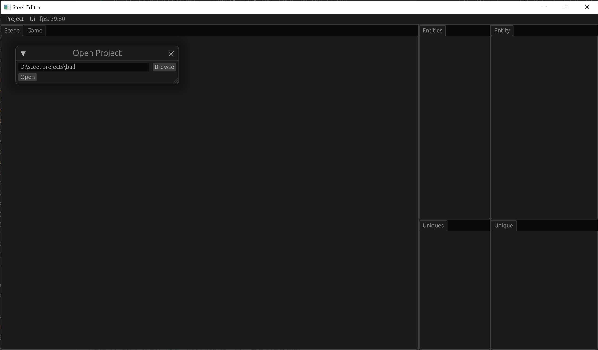
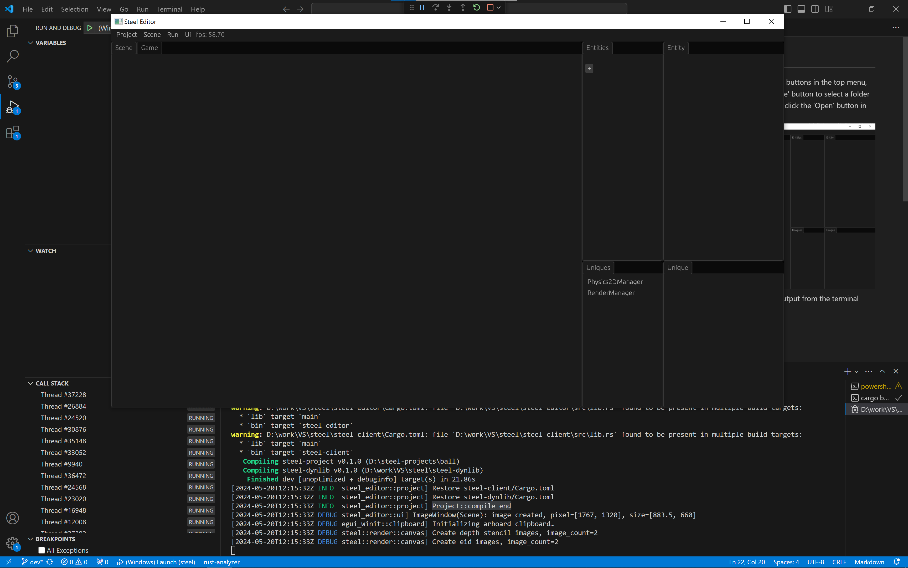

# 创建项目

本章我们创建我们的接球游戏项目。

点击编辑器顶部菜单中的“Project -> Open”按钮，你可以看到“Open Project”对话框。然后点击“Browse”按钮为接球游戏项目选择一个文件夹，例如“D:\steel-projects\ball”。最后点击对话框中的“Open”按钮：

项目会开始编译。你可以从控制台看到编译输出：

当看到“Project::compile end”时，表示项目已经编译成功。

[下一章：编写代码][4]

[上一章：运行Steel编辑器][2]

[0]: 目录.md
[1]: 1-引言.md
[2]: 2-运行Steel编辑器.md
[3]: 3-创建项目.md
[4]: 4-编写代码.md
[5]: 5-场景搭建.md
[6]: 6-玩家控制.md
[7]: 7-推一下球.md
[8]: 8-游戏失败.md
[9]: 9-主菜单.md
