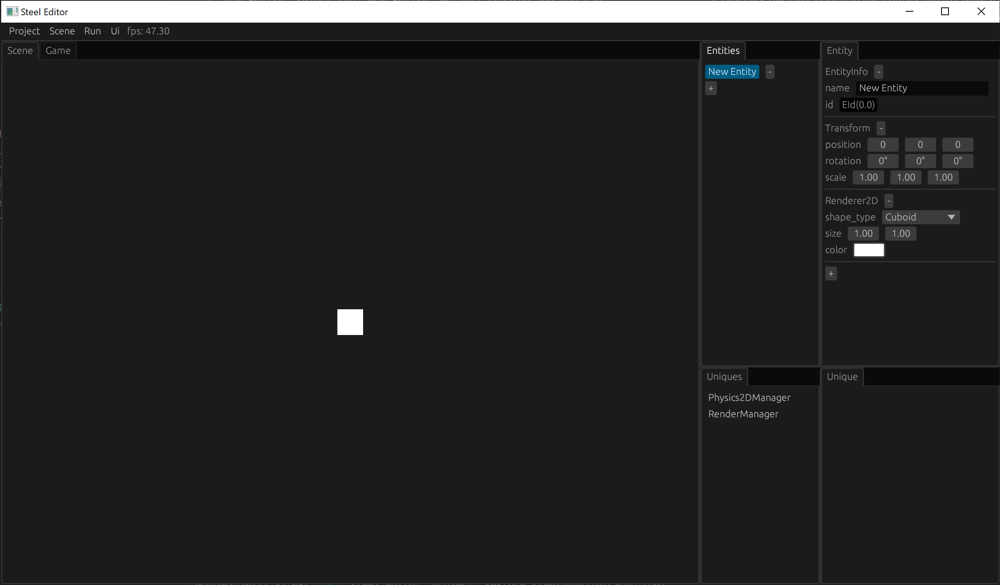
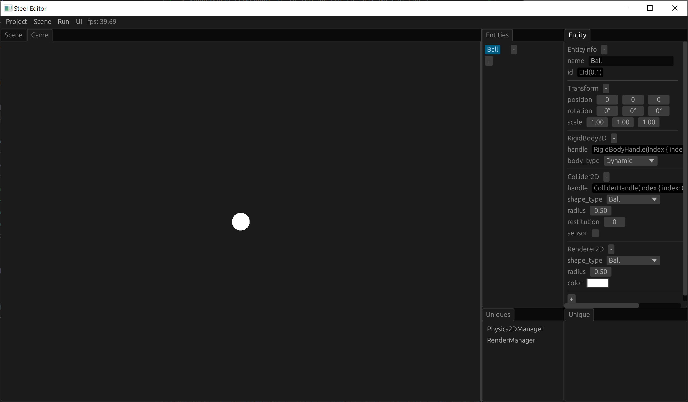
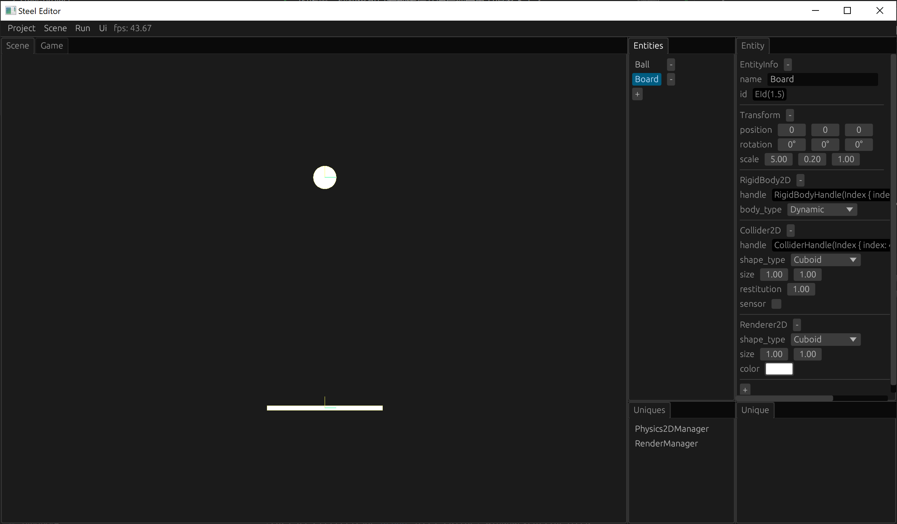
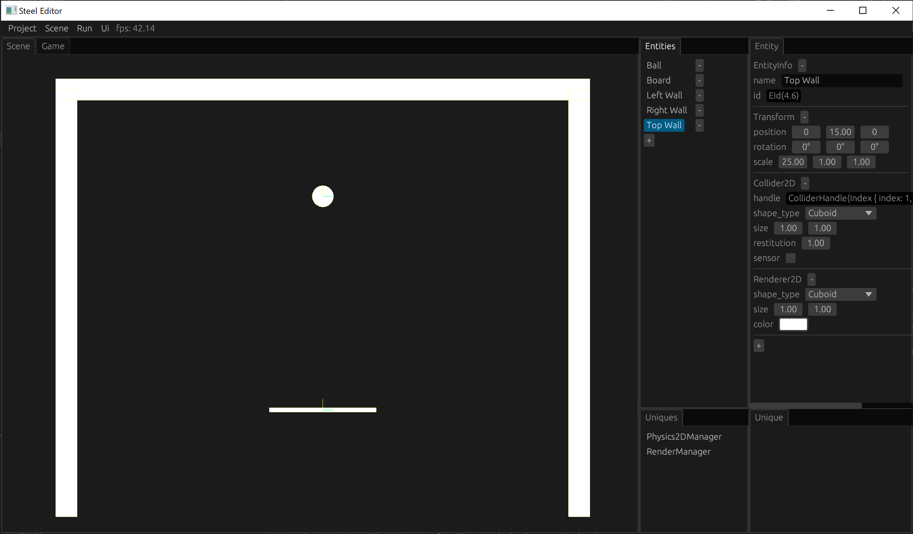
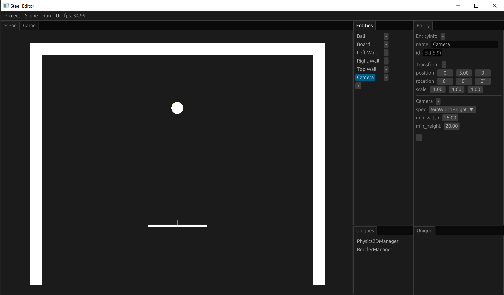

# 场景搭建

本章我们将搭建接球游戏的场景。

## 新建实体

首先点击Entities页面的加号按钮，创建一个新的实体（Entity）。鼠标左键选择刚刚创建的“New Entity”，你可以在右边的Entity页面看到这个实体的所有的组件（Component）：

新建的实体有3个组件：
* EntityInfo：定义了这个实体的名字；
* Transform：定义了这个实体的位置、大小和缩放；
* Renderer2D：绘制一个2D图像，默认形状是矩形。

## 创建球

让我们编辑这个实体作为我们的球吧：
1. 重命名这个实体为“Ball”；
2. 把Renderer2D的shape_type改成“Ball”，这样这个实体就显示为圆形了；
3. 点击Entity页面下面的加号按钮，添加一个RigidBody2D的组件，RigidBody2D的默认body_type是Dynamic，使得这个实体可以受力移动，例如受到重力下落，或是碰撞后反弹；
4. 添加一个Collider2D的组件，Collider2D定义了这个物体的物理形状，因为我们的球是圆的，所以需要将Collider2D的shape_type改成“Ball”。

我们的球创建完成了！你可以点击顶部菜单的“Run -> Start”按钮运行我们的场景，你应该可以看到运行开始后球受重力掉落下去了。

## 创建球板

我们可以使用同样的方式创建接球的板子，只是需要将Renderer2D和Collider2D的shape_type都改成Cuboid，并且调整Transform的scale使其变得细长：

## 创建墙

接下来我们创建用来限制球移动范围的墙，类似于创建板子的方式我们依次创建左边的墙、右边的墙和顶上的墙，墙和板子主要的区别是墙没有RigidBody2D，因为墙应该是完全静止不动的，我们不希望墙被球撞飞：

## 创建相机

现在有一个问题，游戏窗口的比例通常是动态的，如果比例调整后有可能导致我们看不全目前场景里面的所有物体。你可以尝试调整编辑器的Scene窗口的比例，如果窗口变得太窄了，左边的墙和右边的墙有可能就看不到了。Camera组件刚好可以解决这个问题，我们新建一个名字为“Camera”的实体，在上面添加一个Camera组件，Camera的spec有3种模式可以设置：
1. FixedWidth：固定相机的宽度；
2. FixedHeight：固定相机的高度；
3. MinWidthHeight：为相机的宽度和高度指定一个最小值。
我们选择MinWidthHeight就可以确保相机的宽度和高度都可以覆盖全我们的场景物体，这样就解决了我们的问题：

## 保存场景

最后别忘了保存我们的场景，否则下次我们又得重新搭建一遍场景了！

点击编辑器顶部菜单的“Scene -> Save As”按钮，弹出保存的文件选择框，我们输入“game”后选择保存即可，保存的文件会自动加上后缀“.scene”，目前场景文件是json格式的，你可以直接打开查看内容。

注意我们的场景需要保存到游戏项目目录的asset目录下，保存的文件选择框默认就在这个目录。asset目录是游戏的资源目录，场景也属于游戏资源，在游戏打包时会带上asset目录下的所有文件。

当前场景保存后编辑器会记录当前场景保存的位置，下次修改场景后需要再次保存只需要点击顶部菜单的“Scene -> Save”按钮即可。

如果场景修改后想回退到上次保存的状态，点击顶部菜单的“Scene -> Load”加载上次保存的场景文件即可。

[下一章：实现Engine][5]

[上一章：创建项目][3]

[目录][0]

[0]: 目录.md
[1]: 1-引言.md
[2]: 2-运行Steel编辑器.md
[3]: 3-创建项目.md
[4]: 4-场景搭建.md
[5]: 5-实现Engine.md
[6]: 6-玩家控制.md
[7]: 7-推一下球.md
[8]: 8-游戏失败.md
[9]: 9-主菜单.md
