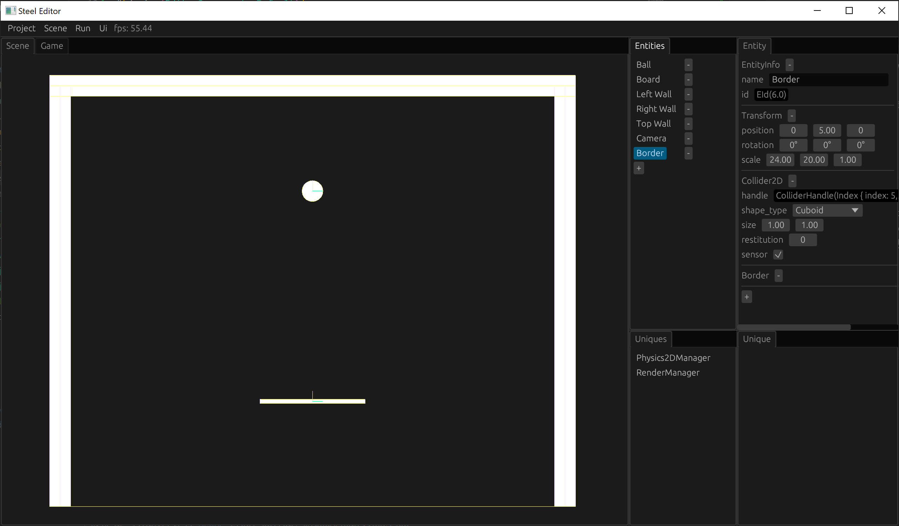

# 游戏失败

如果球掉落到了屏幕外面，则游戏失败，本章实现游戏失败检测机制，并在游戏失败后显示一个游戏失败的提示界面。

## Border实体与Border组件

由于sensor类型的碰撞器可以用来检测是否和另一个碰撞器相交。那么我们可以创建一个以墙和板子为边界区域的sensor类型的碰撞器，持续检测其是否和球的碰撞器相交，如果发现不相交，则说明球已经落到了屏幕外，则判定游戏失败。

我们首先创建一个Border组件用于标记我们的边界实体：

```rust
#[derive(Edit, Component, Default)]
struct Border;
```

同时也注册一下：

```rust
impl Engine for EngineWrapper {
    fn init(&mut self, info: InitInfo) {
        ...
        self.inner.register_component::<Border>();
    }
    ...
}
```

完成代码编写后记得编译一下。

然后在场景中创建一个名字为Border的实体，删除Renderer2D组件，并添加Collider2D组件和Border组件，将Collider2D组件的sensor勾上，并通过更改Transform的position和scale调整其位置和大小，刚好覆盖以墙和板子为边界的区域：



场景修改后记得保存一下。

## 标记游戏失败的Lose组件

一旦检测到游戏失败了，我们可以创建一个Lose组件，来标记游戏已经失败的状态：

```rust
#[derive(Component)]
struct Lose;
```

Lose组件只由我们的代码创建生成，不需要在编辑器里面编辑，因此也就不需要实现Edit了，也不需要注册了。

## 边界检查系统border_check_system

准备好了我们的sensor碰撞器和标记游戏失败的组件之后，就可以写一个边界检查系统border_check_system，持续检查球是否掉出屏幕：

```rust
fn border_check_system(border: View<Border>, ball: View<Ball>, mut lose: ViewMut<Lose>, col2d: View<Collider2D>, physics2d_manager: UniqueView<Physics2DManager>) {
    let mut border_entity = EntityId::dead();
    for (entity, (_border, border_col2d, _)) in (&border, &col2d, !&lose).iter().with_id() {
        for (_ball, ball_col2d) in (&ball, &col2d).iter() {
            let intersection_pair = physics2d_manager.narrow_phase.intersection_pair(border_col2d.handle(), ball_col2d.handle());
            if intersection_pair.is_none() {
                border_entity = entity;
            }
        }
    }
    if border_entity != EntityId::dead() {
        lose.add_component_unchecked(border_entity, Lose);
    }
}
```

通过查找有Border组件且没有Lose组件的实体得到其Collider2D组件，再通过查找有Ball组件的实体得到其Collider2D组件，然后通过narrow_phase.intersection_pair方法判断2个碰撞器是否相交，如果不相交，则为Border实体添加一个Lose组件，标记游戏失败了。

## 显示游戏失败的系统lose_system

游戏失败后，我们在屏幕中间显示提示游戏失败的界面，通过lose_system实现：

```rust
fn lose_system(lose: View<Lose>, egui_ctx: UniqueView<EguiContext>) {
    for _lose in (&lose).iter() {
        egui::CentralPanel::default().show(&egui_ctx, |ui| {
            ui.with_layout(egui::Layout::centered_and_justified(egui::Direction::TopDown), |ui| {
                ui.label(egui::RichText::new("You lose!").size(100.0));
            });
        });
    }
}
```

border_check_system和lose_system都放到FrameStage::Update中运行即可：

```rust
impl Engine for EngineWrapper {
    ...
    fn frame(&mut self, info: &FrameInfo) {
        self.inner.frame(info);
        match info.stage {
            FrameStage::Maintain => (),
            FrameStage::Update => {
                ...
                self.inner.world.run(border_check_system);
                self.inner.world.run(lose_system);
            },
            FrameStage::Finish => (),
        }
    }
    ...
}
```

再次编译运行游戏，让球掉落到屏幕外面，我们就可以在屏幕中间看到“You lose！”的提示了。

[下一章：主菜单][9]

[上一章：推一下球][7]

[目录][0]

[0]: 目录.md
[1]: 1-引言.md
[2]: 2-运行Steel编辑器.md
[3]: 3-创建项目.md
[4]: 4-场景搭建.md
[5]: 5-实现Engine.md
[6]: 6-玩家控制.md
[7]: 7-推一下球.md
[8]: 8-游戏失败.md
[9]: 9-主菜单.md
