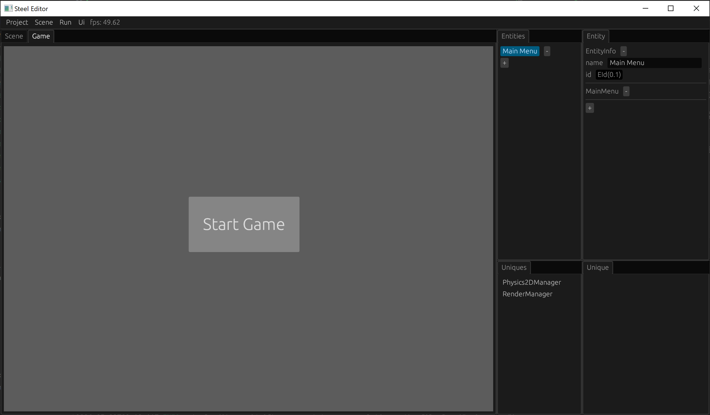

# 主菜单

通常游戏都会有一个主菜单，我们可以从主菜单开始游戏，游戏失败后回到主菜单，我们可以重新开始游戏。本章我们在Ball游戏中实现一个简单的主菜单。

## 标记显示主菜单的MainMenu组件

我们首先创建一个MainMenu组件，用来标记当前是否显示主菜单：

```rust
#[derive(Edit, Component, Default)]
struct MainMenu;
```

并注册MainMenu组件：

```rust
impl Engine for EngineWrapper {
    fn init(&mut self, info: InitInfo) {
        ...
        self.inner.register_component::<MainMenu>();
    }
    ...
}
```

## 显示主菜单的系统main_menu_system

如果存在MainMenu组件，则通过系统main_menu_system来显示主菜单：

```rust
fn main_menu_system(main_menu_component: View<MainMenu>, egui_ctx: UniqueView<EguiContext>, mut scene_manager: UniqueViewMut<SceneManager>) {
    for _ in main_menu_component.iter() {
        egui::CentralPanel::default().show(&egui_ctx, |ui| {
            let available_size = ui.available_size();
            let button_center = egui::pos2(available_size.x / 2.0, available_size.y / 2.0);
            let button_size = egui::vec2(200.0, 100.0);
            let button_rect = egui::Rect::from_center_size(button_center, button_size);
            if ui.put(button_rect, egui::Button::new(egui::RichText::new("Start Game").size(30.0))).clicked() {
                scene_manager.switch_scene("game.scene".into());
            }
        });
    }
}
```

我们不把主菜单放到游戏场景，而是把主菜单单独放到另一个场景，当用户点击开始游戏按钮“Start Game”的时候，通过SceneManager的switch_scene方法跳转到游戏场景。

主菜单场景和游戏场景分开主要有以下好处：
* 主菜单界面不需要加载游戏场景的所有实体；
* 每次从主菜单场景跳转到游戏场景时，游戏场景的所有实体和组件自动还原，不需要我们手动做还原场景的工作。

我们把main_menu_system放到FrameStage::Maintain中，这样我们在编辑器中没有运行游戏的时候，就可以在游戏场景窗口看到主菜单界面显示效果：

```rust
impl Engine for EngineWrapper {
    ...
    fn frame(&mut self, info: &FrameInfo) {
        self.inner.frame(info);
        match info.stage {
            FrameStage::Maintain => {
                self.inner.world.run(main_menu_system);
            },
            ...
        }
    }
    ...
}
```

## 创建主菜单场景

首先编译一下刚才写的代码，就可以开始创建我们的主菜单场景了。

点击编辑器顶部菜单的“Scene -> New”按钮创建一个新的场景，添加一个名字为“Main Menu”的实体，删除这个实体的Renderer2D组件和Transform组件，然后添加MainMenu组件。

这样我们的主菜单场景就完成了，点击编辑器顶部菜单的“Scene -> Save As”按钮，设置场景的名字为“main”，点击保存即可。

切换到游戏场景窗口，在没有运行游戏的时候，应该就可以看到主菜单的显示效果了：



## 游戏失败后回到主菜单

最后我们实现一个游戏失败后，延迟5秒回到主菜单功能。

为了实现5秒的计时，我们在Lose组件上添加剩余时间记录：

```rust
#[derive(Component)]
struct Lose {
    lose_time: f32,
}

impl Default for Lose {
    fn default() -> Self {
        Lose { lose_time: 5.0 }
    }
}
```

在border_check_system中，我们通过Lose的default方法来创建Lose组件：

```rust
fn border_check_system(border: View<Border>, ball: View<Ball>, mut lose: ViewMut<Lose>, col2d: View<Collider2D>, physics2d_manager: UniqueView<Physics2DManager>) {
    ...
    if border_entity != EntityId::dead() {
        lose.add_component_unchecked(border_entity, Lose::default());
    }
}
```

最后修改我们的lose_system实现5秒计时结束后切换到主菜单场景：

```rust
fn lose_system(mut lose: ViewMut<Lose>, time: UniqueView<Time>, egui_ctx: UniqueView<EguiContext>, mut scene_manager: UniqueViewMut<SceneManager>) {
    for lose in (&mut lose).iter() {
        ...
        lose.lose_time -= time.delta();
        if lose.lose_time < 0.0 {
            scene_manager.switch_scene("main.scene".into());
        }
    }
}
```

我们通过Time单例的delta方法获取上一帧的耗时，然后在lose_time中减去上一帧的耗时，直到lose_time小于0，就说明过了5秒了，我们就使用SceneManager单例的switch_scene方法切换到“main.scene”。

最后编译代码，在主菜单场景运行游戏。点击开始游戏按钮，切换到游戏场景，游戏失败后5秒会自动切回主菜单场景，这样我们的游戏界面形成了闭环，用户不再需要重新运行游戏程序来重新开始游戏了！

[上一章：游戏失败][8]

[目录][0]

[0]: 目录.md
[1]: 1-引言.md
[2]: 2-运行Steel编辑器.md
[3]: 3-创建项目.md
[4]: 4-场景搭建.md
[5]: 5-实现Engine.md
[6]: 6-玩家控制.md
[7]: 7-推一下球.md
[8]: 8-游戏失败.md
[9]: 9-主菜单.md
