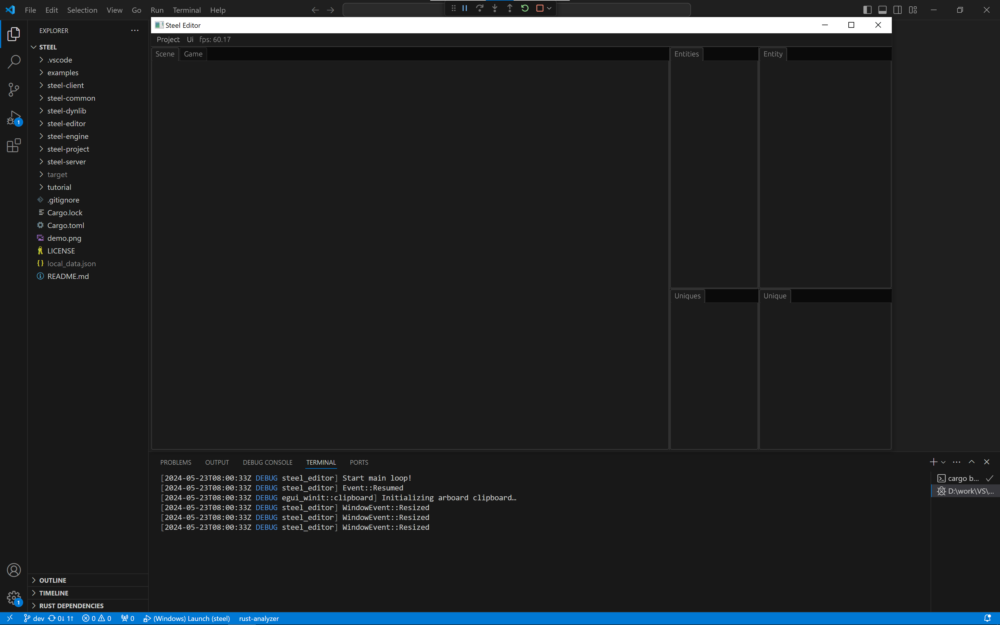

# Run Steel Editor

## Set up the environment

Currently, it is recommended to run in VSCode, convenient for debugging.
1. Install [Visual Studio 2022][Visual Studio 2022] with "Desktop development with C++" in Windows, keep the default check
2. Install [Rust][Rust], [Git][Git], [Python][Python], [CMake][CMake] and [Ninja][Ninja] for [shaderc-rs][shaderc-rs]
3. Install [VSCode][VSCode] with "C/C++" and "rust-analyzer" extensions
4. Download the code of the Steel, and checkout "v0.2" branch, because the current tutorial is written based on this version:
```
git clone https://github.com/SSSxCCC/steel
cd steel
git checkout v0.2
```
5. Use VSCode to open the root directory "steel", press F5 to compile and run

There is a bug in VSCode failing to run the exe file when pressing the F5 for the first time. You can compile and run the exe file in terminal:
```
cargo run -p steel-editor -F desktop
```

## Steel editor UI introduction

After successfully running the Steel editor, you can see the following interface:



In front of the entire interface is the editor window. In the editor window there are top menu function buttons and multiple tabs. Tabs mainly include:
* Scene: Scene window, this window is used to view scene content;
* Game: Game window, this window is used to view the actual game screen;
* Entities: Displays all entities in the current scene;
* Entity: Displays all components of the currently selected entity;
* Uniques: Display all uniques in the current scene;
* Unique: Displays the contents of the currently selected unique.

Behind the editor window is the VSCode window. All logs output in the editor are displayed in the terminal below VSCode. Currently, all Steel engine codes have been opened in VSCode and can be viewed and modified at any time. At the same time, VSCode is also used to view and modify the project code created by the Steel editor. The specific method will be introduced in subsequent chapters.

There is an examples directory under the Steel engine source code directory, and there is a ball directory under it, which is the final content of the catch ball game of the example project of this tutorial. If you encounter difficulties while reading this tutorial, you can open the ball directory under the examples directory at any time for reference.

[Next: Create Project][3]

[Prev: Introduction][1]

[Table of Contents][0]

[0]: table-of-contents.md
[1]: 1-introduction.md
[2]: 2-run-steel-editor.md
[3]: 3-create-project.md
[4]: 4-scene-building.md
[5]: 5-engine-implementation.md
[6]: 6-player-control.md
[7]: 7-push-the-ball.md
[8]: 8-game-lost.md
[9]: 9-main-menu.md
[Rust]: https://www.rust-lang.org/
[Git]: https://git-scm.com/
[Python]: https://www.python.org/
[CMake]: https://cmake.org/
[Ninja]: https://github.com/ninja-build/ninja/releases
[shaderc-rs]: https://github.com/google/shaderc-rs
[Visual Studio 2022]: https://visualstudio.microsoft.com/vs/
[VSCode]: https://code.visualstudio.com/
