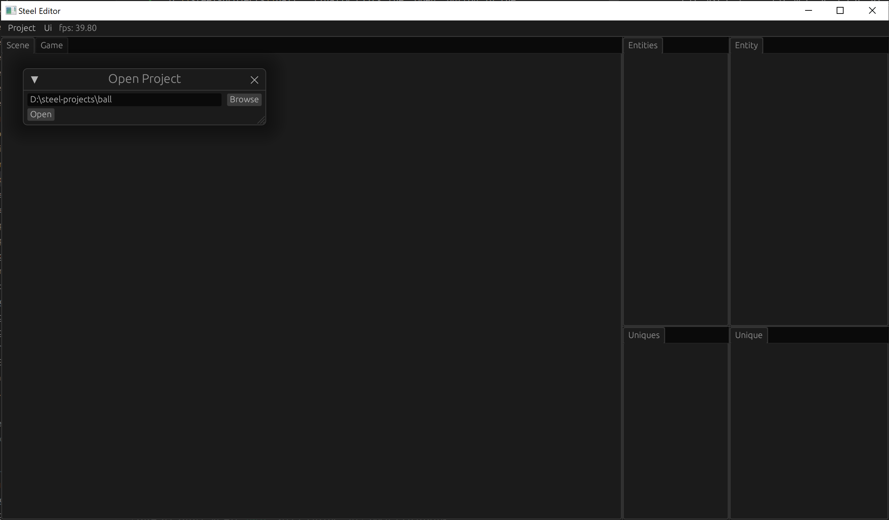

# Create Project

In this chapter we create our ball game project.

Click the "Project -> Open" button in the top menu of the editor and you can see the "Open Project" dialog. Then click the "Browse" button to select a folder for the ball game project, for example "D:\steel-projects\ball". Finally click the "Open" button in the dialog:

The project will start compiling. You can see the compilation output from the terminal:

When you see "Project::compile end", it means that the project has been compiled successfully.

[Next: Scene building][4]

[Prev: Run Steel Editor][2]

[Table of Contents][0]

[0]: table-of-contents.md
[1]: 1-introduction.md
[2]: 2-run-steel-editor.md
[3]: 3-create-project.md
[4]: 4-scene-building.md
[5]: 5-engine-implementation.md
[6]: 6-player-control.md
[7]: 7-push-the-ball.md
[8]: 8-game-lost.md
[9]: 9-main-menu.md
