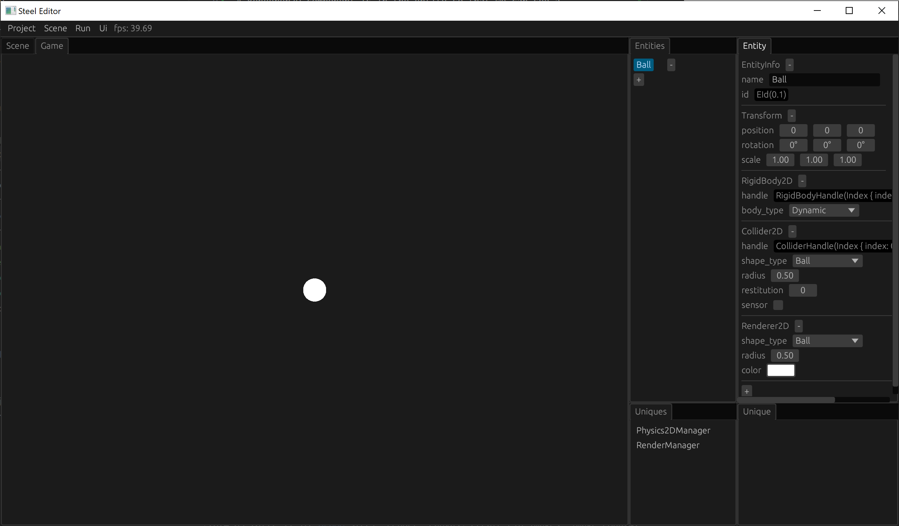
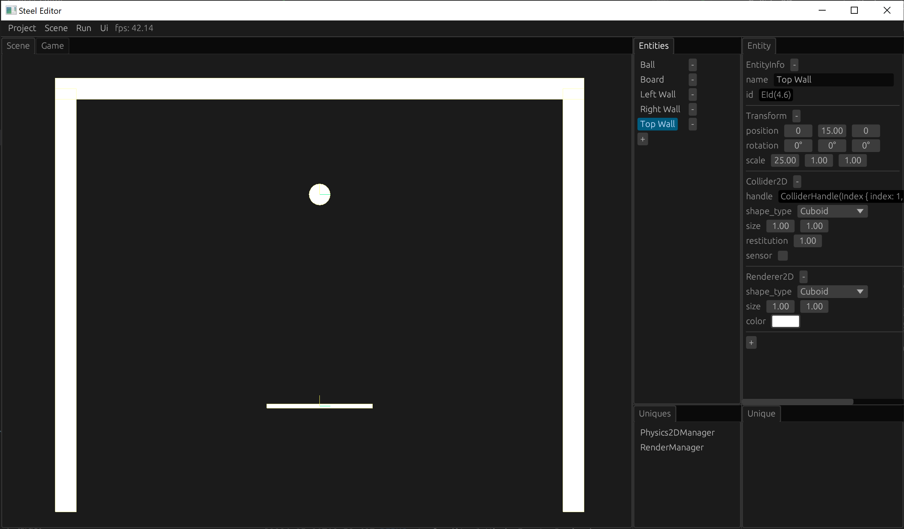

# Scene Building

In this chapter we will build the scene of the Ball game.

## Create new entity

First click the plus button on the Entities tab to create a new entity. Select the "New Entity" just created with the left mouse button. You can see all the components of this entity on the Entity tab on the right:

The newly created entity has 3 components:
* EntityInfo: defines the name of this entity;
* Transform: defines the position, size and scaling of this entity;
* Renderer2D: Draw a 2D image, the default shape is a rectangle.

## Create the ball

Let's edit this entity to be our ball:
1. Rename this entity to "Ball";
2. Change the shape_type of Renderer2D to "Ball" so that the entity appears as a circle;
3. Click the plus button at the bottom of the Entity tab to add a RigidBody2D component. The default body_type of RigidBody2D is Dynamic, so that the entity can move under force, such as falling due to gravity, or rebounding after collision;
4. Add a Collider2D component. Collider2D defines the physical shape of this object. Because our ball is round, we need to change the shape_type of Collider2D to "Ball".

Our ball creation is complete! You can click the "Run -> Start" button on the top menu to run our scene. You should be able to see the ball falling due to gravity after the run starts.

## Create the board

We can use the same method to create a board that catches the ball. We just need to change the shape_type of both Renderer2D and Collider2D to Cuboid, and adjust the scale of the Transform to make it slender:

## Create walls

Next we create walls to limit the movement range of the ball. Similar to how we create a board, we create the left wall, the right wall and the top wall in sequence. The main difference between the wall and the board is that the wall does not have a RigidBody2D, since the wall should be completely stationary, we don't want it to be knocked away by the ball:

## Create the camera

Now there is a problem. The aspect ratio of the game window is usually dynamic. If the aspect ratio is adjusted, we may not be able to see all the objects in the current scene. You can try to adjust the aspect ratio of the editor's Scene window. If the window becomes too narrow, the left and right walls may not be visible. The Camera component can solve this problem. We create a new entity named "Camera" and add a Camera component to it. The Camera spec has 3 modes to set:
1. FixedWidth: Fixed camera width;
2. FixedHeight: Fixed camera height;
3. MinWidthHeight: Specify a minimum value for the camera's width and height.
We select MinWidthHeight to ensure that the camera's width and height can cover all our scene objects, which solves our problem:

## Save the scene

Finally, don’t forget to save our scene, otherwise we will have to build it again next time!

Click the "Scene -> Save As" button in the top menu of the editor. A file save dialog will pop up. Enter "game" and choose Save. The saved file will automatically be added with the suffix ".scene". Currently, the scene file is in json format, so you can open it directly to view the content.

Note that our scene needs to be saved in the asset directory of the game project directory. The file save dialog is in this directory by default. The asset directory is the resource directory of the game, and the scene is also a game resource. When the game is packaged, all files in the asset directory will be included.

After the current scene is saved, the editor will record the location where the current scene is saved. The next time you modify the scene and need to save it again, just click the "Scene -> Save" button in the top menu.

If you want to roll back to the last saved state after modifying the scene, click "Scene -> Load" in the top menu to load the last saved scene file.

[Next: Engine Implementation][5]

[Prev: Create Project][3]

[Table of Contents][0]

[0]: table-of-contents.md
[1]: 1-introduction.md
[2]: 2-run-steel-editor.md
[3]: 3-create-project.md
[4]: 4-scene-building.md
[5]: 5-engine-implementation.md
[6]: 6-player-control.md
[7]: 7-push-the-ball.md
[8]: 8-game-lost.md
[9]: 9-main-menu.md
