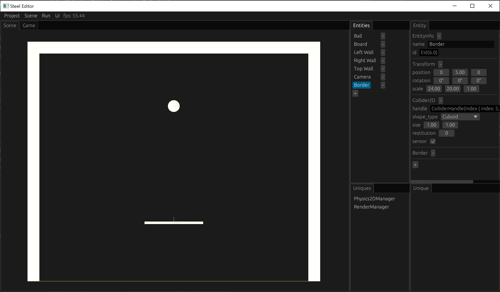

# Game Lost

If the ball falls outside the screen, the game lost. This chapter implements the game lost detection mechanism and displays a game lost prompt interface after the game lost.

## Border entity and Border component

Since sensor colliders can be used to detect whether they intersect with another collider, we can create a sensor collider with the wall and the board as the boundary area, and continuously detect whether it intersects with the ball's collider. If it is found that there is no intersection, it means that the ball has fallen outside the screen, and the game is considered to have lost.

We first create a Border component to mark our border entity:

```rust
#[derive(Edit, Component, Default)]
struct Border;
```

Also register:

```rust
#[no_mangle]
pub fn create() -> Box<dyn App> {
    SteelApp::new()
        ...
        .register_component::<Border>()
        ...
}
```

Remember to compile after you finish writing the code.

Then create an entity named Border in the scene, delete the Renderer2D component, and add the Collider2D component and the Border component. Check the sensor of the Collider2D component, and adjust its position and size by changing the position and scale of the Transform to just cover the area bounded by the wall and the board:



Remember to save the scene after modifying it.

## Lose component that marks game lost

Once we detect that the game has lost, we can create a Lose component to mark the state where the game has lost:

```rust
#[derive(Component)]
struct Lose;
```

The Lose component is only created by our code and does not need to be edited in the editor, so there is no need to implement Edit or register it.

## border_check_system

After preparing our sensor collider and the component that marks the game lost, we can write a border_check_system to continuously check whether the ball falls off the screen:

```rust
fn border_check_system(
    border: View<Border>,
    ball: View<Ball>,
    mut lose: ViewMut<Lose>,
    col2d: View<Collider2D>,
    physics2d_manager: UniqueView<Physics2DManager>,
) {
    let mut border_entity = EntityId::dead();
    for (entity, (_border, border_col2d, _)) in (&border, &col2d, !&lose).iter().with_id() {
        for (_ball, ball_col2d) in (&ball, &col2d).iter() {
            let intersection_pair = physics2d_manager
                .narrow_phase
                .intersection_pair(border_col2d.handle(), ball_col2d.handle());
            if intersection_pair.is_none() {
                border_entity = entity;
            }
        }
    }
    if border_entity != EntityId::dead() {
        lose.add_component_unchecked(border_entity, Lose);
    }
}
```

By finding the entity with Border component and no Lose component, its Collider2D component is obtained. Then, by finding the entity with Ball component, its Collider2D component is obtained. Then, the narrow_phase.intersection_pair method is used to determine whether the two colliders intersect. If they do not intersect, a Lose component is added to the Border entity, marking the game as lost.

## Lose_system showing game lost

After the game lost, we display an interface in the middle of the screen to prompt the game lost, which is implemented through lose_system:

```rust
fn lose_system(
    mut lose: View<Lose>,
    egui_ctx: UniqueView<EguiContext>,
) {
    for _lose in (&lose).iter() {
        egui::CentralPanel::default().show(&egui_ctx, |ui| {
            ui.with_layout(
                egui::Layout::centered_and_justified(egui::Direction::TopDown),
                |ui| {
                    ui.label(egui::RichText::new("You lose!").size(100.0));
                },
            );
        });
    }
}
```

Both border_check_system and lose_system can be run in Schedule::Update:

```rust
#[no_mangle]
pub fn create() -> Box<dyn App> {
    SteelApp::new()
        ...
        .add_system(Schedule::Update, border_check_system)
        .add_system(Schedule::Update, lose_system)
        .boxed()
}
```

Compile and run the game again, let the ball fall off the screen, and we can see the prompt "You lose!" in the middle of the screen.

[Next: Main Menu][9]

[Prev: Push the Ball][7]

[Table of Contents][0]

[0]: table-of-contents.md
[1]: 1-introduction.md
[2]: 2-run-steel-editor.md
[3]: 3-create-project.md
[4]: 4-write-code.md
[5]: 5-scene-building.md
[6]: 6-player-control.md
[7]: 7-push-the-ball.md
[8]: 8-game-lost.md
[9]: 9-main-menu.md
