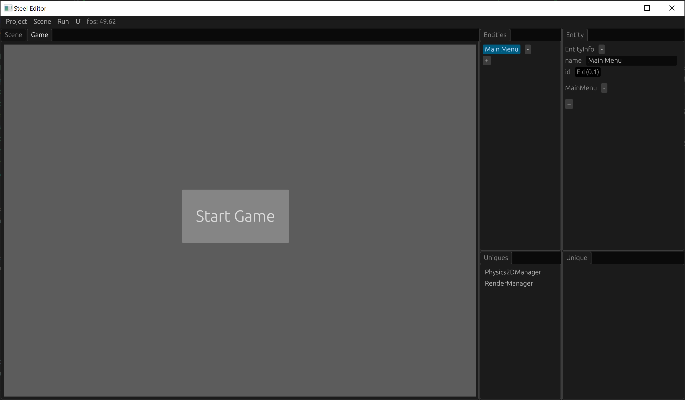

# Main Menu

Usually the game will have a main menu, we can start the game from the main menu, after the game lost, we return to the main menu, we can restart the game. In this chapter, we implement a simple main menu in the Ball game.

## MainMenu component

We first create a MainMenu component to mark whether the main menu is currently displayed:

```rust
#[derive(Edit, Component, Default)]
struct MainMenu;
```

And register the MainMenu component:

```rust
impl Engine for EngineWrapper {
    fn init(&mut self, info: InitInfo) {
        ...
        self.inner.register_component::<MainMenu>();
    }
    ...
}
```

## main_menu_system

If the MainMenu component exists, the main menu is displayed through the main_menu_system:

```rust
fn main_menu_system(main_menu_component: View<MainMenu>, egui_ctx: UniqueView<EguiContext>, mut scene_manager: UniqueViewMut<SceneManager>) {
    for _ in main_menu_component.iter() {
        egui::CentralPanel::default().show(&egui_ctx, |ui| {
            let available_size = ui.available_size();
            let button_center = egui::pos2(available_size.x / 2.0, available_size.y / 2.0);
            let button_size = egui::vec2(200.0, 100.0);
            let button_rect = egui::Rect::from_center_size(button_center, button_size);
            if ui.put(button_rect, egui::Button::new(egui::RichText::new("Start Game").size(30.0))).clicked() {
                scene_manager.switch_scene("game.scene".into());
            }
        });
    }
}
```

We do not put the main menu in the game scene, but put the main menu in another scene. When the user clicks the start game button "Start Game", we jump to the game scene through the switch_scene method of SceneManager.

The main advantages of separating the main menu scene from the game scene are as follows:
* The main menu interface does not need to load all entities of the game scene;
* Every time you jump from the main menu scene to the game scene, all entities and components of the game scene are automatically restored, and we do not need to manually restore the scene.

We put main_menu_system in FrameStage::Maintain, so that when we are not running the game in the editor, we can see the main menu interface display effect in the game scene window:

```rust
impl Engine for EngineWrapper {
    ...
    fn frame(&mut self, info: &FrameInfo) {
        self.inner.frame(info);
        match info.stage {
            FrameStage::Maintain => {
                self.inner.world.run(main_menu_system);
            },
            ...
        }
    }
    ...
}
```

## Creating the main scene

First, compile the code you just wrote, and then you can start creating our main menu scene.

Click the "Scene -> New" button in the top menu of the editor to create a new scene, add an entity named "Main Menu", delete the Renderer2D component and Transform component of this entity, and then add the MainMenu component.

Now our main menu scene is complete. Click the "Scene -> Save As" button in the top menu of the editor, set the name of the scene to "main", and click Save.

Switch to the game scene window. When the game is not running, you should be able to see the display effect of the main menu:



## Return to the main menu after losing the game

Finally, we implemented a 5-second delay to return to the main menu after a game lost.

In order to achieve 5 seconds of timing, we add the remaining time record to the Lose component:

```rust
#[derive(Component)]
struct Lose {
    lose_time: f32,
}

impl Default for Lose {
    fn default() -> Self {
        Lose { lose_time: 5.0 }
    }
}
```

In border_check_system, we create the Lose component through the default method of Lose:

```rust
fn border_check_system(border: View<Border>, ball: View<Ball>, mut lose: ViewMut<Lose>, col2d: View<Collider2D>, physics2d_manager: UniqueView<Physics2DManager>) {
    ...
    if border_entity != EntityId::dead() {
        lose.add_component_unchecked(border_entity, Lose::default());
    }
}
```

Finally, modify our lose_system to switch to the main menu scene after the 5-second timer ends:

```rust
fn lose_system(mut lose: ViewMut<Lose>, time: UniqueView<Time>, egui_ctx: UniqueView<EguiContext>, mut scene_manager: UniqueViewMut<SceneManager>) {
    for lose in (&mut lose).iter() {
        ...
        lose.lose_time -= time.delta();
        if lose.lose_time < 0.0 {
            scene_manager.switch_scene("main.scene".into());
        }
    }
}
```

We use the delta method of the Time unique to get the duration of the previous frame, and then subtract the duration of the previous frame from the lose_time. When the lose_time is less than 0, it means that 5 seconds have passed. We then use the switch_scene method of the SceneManager unique to switch to "main.scene".

Finally, compile the code and run the game in the main menu scene. Click the start game button to switch to the game scene. After the game lost, it will automatically switch back to the main menu scene 5 seconds later. In this way, our game interface forms a closed loop, and users no longer need to re-run the game program to restart the game!

[Prev: Game Lost][8]

[Table of Contents][0]

[0]: table-of-contents.md
[1]: 1-introduction.md
[2]: 2-run-steel-editor.md
[3]: 3-create-project.md
[4]: 4-scene-building.md
[5]: 5-engine-implementation.md
[6]: 6-player-control.md
[7]: 7-push-the-ball.md
[8]: 8-game-lost.md
[9]: 9-main-menu.md
